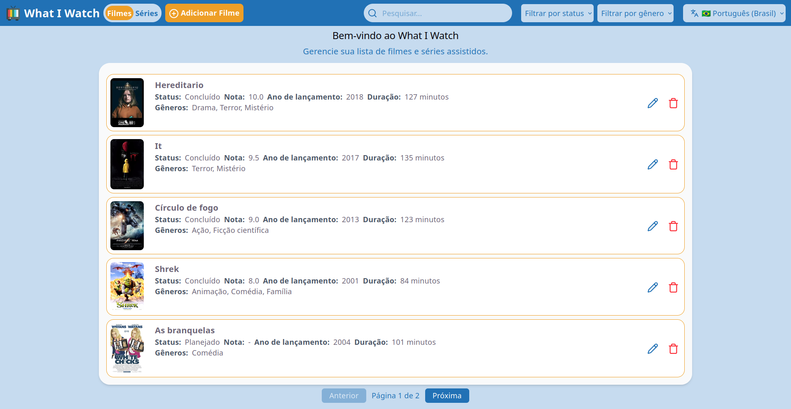

# 🎬 What I Watch

Uma aplicação web full-stack para gerenciar filmes e séries assistidos ou que você pretende assistir.

A full-stack web application for managing movies and TV shows you have watched or plan to watch.

**[🇧🇷 Português](#-português) | [🇺🇸 English](#-english)**

---

## 🇧🇷 Português

### ✨ Funcionalidades

- Adição, edição e exclusão de filmes e séries
- Acompanhamento do status de cada mídia
- Avaliação de filmes e séries
- Organização por gêneros
- Upload de pôsteres
- Busca por título
- Filtros por status e gênero
- Paginação da lista de mídias
- Interface disponível em português, inglês e espanhol

### 📸 Preview



### 🛠️ Tecnologias

#### Backend

- Python
- Django
- Django REST Framework
- MariaDB

#### Frontend

- React
- TypeScript
- Vite
- Tailwind CSS
- i18next
- Lucide React

### 📁 Estrutura do projeto

```text
what-i-watched/
├── backend/
│   ├── config/
│   ├── media/
│   │   ├── migrations/
│   │   └── utils/
│   └── files/
│       └── cover_images/
├── docs/
└── frontend/
    ├── i18n/
    ├── public/
    └── src/
        ├── assets/
        ├── components/
        ├── hooks/
        ├── pages/
        └── types/
```

O backend fornece uma API REST responsável pelo gerenciamento de filmes, séries e gêneros, enquanto o frontend consome a API e fornece a interface da aplicação.

### 📋 Requisitos

- Python 3.12.3
- Node.js 22
- npm
- MariaDB 10.11

### 🚀 Executando o projeto

#### Backend

Acesse o diretório do backend:

```bash
cd backend
```

Crie e ative um ambiente virtual:

```bash
python -m venv env
source env/bin/activate
```

Instale as dependências:

```bash
pip install -r requirements.txt
```

Crie um arquivo `.env` com base no arquivo de exemplo e configure as variáveis de ambiente, incluindo as informações de conexão com o banco de dados.

Execute as migrations:

```bash
python manage.py migrate
```

Inicie o servidor:

```bash
python manage.py runserver
```

#### Frontend

Em outro terminal, acesse o diretório do frontend:

```bash
cd frontend
```

Instale as dependências:

```bash
npm install
```

Crie um arquivo `.env` e configure a URL da API:

```env
VITE_API_URL=http://localhost:8000
```

Inicie a aplicação:

```bash
npm run dev
```

### 🌎 Internacionalização

A interface está disponível em:

- 🇧🇷 Português
- 🇺🇸 Inglês
- 🇪🇸 Espanhol

O idioma selecionado é armazenado no navegador.

---

## 🇺🇸 English

### ✨ Features

- Add, edit, and delete movies and TV shows
- Track the watching status of each media item
- Rate movies and TV shows
- Organize media by genre
- Upload posters
- Search by title
- Filter by status and genre
- Paginated media list
- Interface available in Portuguese, English, and Spanish

### 📸 Preview


### 🛠️ Technologies

#### Backend

- Python
- Django
- Django REST Framework
- MariaDB

#### Frontend

- React
- TypeScript
- Vite
- Tailwind CSS
- i18next
- Lucide React

### 📁 Project structure

```text
what-i-watched/
├── backend/
│   ├── config/
│   ├── media/
│   │   ├── migrations/
│   │   └── utils/
│   └── files/
│       └── cover_images/
├── docs/
└── frontend/
    ├── i18n/
    ├── public/
    └── src/
        ├── assets/
        ├── components/
        ├── hooks/
        ├── pages/
        └── types/
```

The backend provides a REST API for managing movies, TV shows, and genres, while the frontend consumes the API and provides the application's user interface.

### 📋 Requirements

- Python 3.12.3
- Node.js 22
- npm
- MariaDB 10.11

### 🚀 Running the project

#### Backend

Navigate to the backend directory:

```bash
cd backend
```

Create and activate a virtual environment:

```bash
python -m venv env
source env/bin/activate
```

Install the dependencies:

```bash
pip install -r requirements.txt
```

Create a `.env` file based on the provided example and configure the environment variables, including the database connection settings.

Run the migrations:

```bash
python manage.py migrate
```

Start the development server:

```bash
python manage.py runserver
```

#### Frontend

In another terminal, navigate to the frontend directory:

```bash
cd frontend
```

Install the dependencies:

```bash
npm install
```

Create a `.env` file and configure the API URL:

```env
VITE_API_URL=http://localhost:8000
```

Start the application:

```bash
npm run dev
```

### 🌎 Internationalization

The interface is available in:

- 🇧🇷 Portuguese
- 🇺🇸 English
- 🇪🇸 Spanish

The selected language is persisted in the browser.

---

## 📄 Licença / License

Este projeto foi desenvolvido para fins de estudo e portfólio.

This project was developed for educational and portfolio purposes.